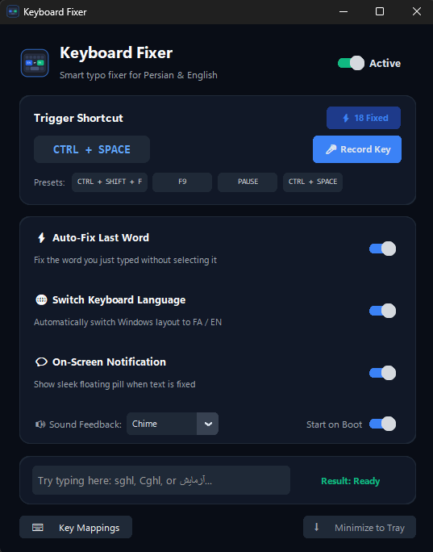

# ⌨️ Keyboard Fixer Pro

<p align="center">
  
</p>

<p align="center">
  <b>Instant bidirectional typo fixer between English and Persian for Windows</b><br />
  Automatically fixes mistyped text in-place, switches Windows keyboard layout, and lives quietly in your system tray.
</p>

<p align="center">
  
  
  
</p>

---

<p align="center">
  
</p>

---

## 🌟 Highlights & Key Features

* **⚡ Smart Auto-Fix (No Selection Required):**
  Just finished typing a word and realized your layout was wrong? Simply hit your shortcut (e.g. `Ctrl + Space` or `Ctrl + Shift + F`) right at the end of the word (`sghl` ➔ `سلام`). No need to touch your mouse or highlight text!
* **📝 Full Paragraph / Selection Mode:**
  Select multiple words or paragraphs with your mouse or keyboard anywhere in Windows, press the shortcut, and watch them convert instantly in-place.
* **🌐 Automatic Windows Layout Switching:**
  Immediately switches the active Windows keyboard language between **Persian (`00000429`)** and **English (`00000409`)** via native Win32 APIs, so you can continue typing without pause.
* **⌨️ Full Shift & Special Characters Support:**
  Accurately converts Shift-modified characters:
  * `Shift + C` ➔ **ژ** (Standard Persian)
  * `Shift + V` ➔ **Zero-Width Non-Joiner (نیم‌فاصله)**
  * `Shift + H` ➔ **آ**
  * Persian punctuation: `،` (`Shift+T`), `؛` (`Shift+Y`), `؟` (`Shift+?`), quotation marks `«` `»`, and tanwin/diacritics.
* **🎨 Modern Luxury Dark UI:**
  Built with CustomTkinter featuring an Obsidian Dark palette (`#090d16`), native Windows 11 `Segoe UI Variable` typography, high-DPI scaling, and an instant interactive test bar.
* **💬 Floating On-Screen Display (OSD):**
  A sleek, semi-transparent pill notification appears near the bottom-right corner showing what was converted and disappears automatically after 1.5s.
* **🔊 Audio Feedback:**
  Customizable audio styles: **Soft Click**, **Chime**, **System Beep**, or **Mute**.
* **🚀 System Tray & Startup Integration:**
  Minimizes to the Windows system tray near the clock. Single-click toggle to automatically start with Windows on boot.
* **🛠 Key Mappings Visual Editor:**
  Easily customize individual character mappings, or toggle between **Persian Standard (ISIRI 9147)** and **Windows Legacy**.

---

## 🚀 Installation & Usage

### 1. Requirements
* Windows 10 or Windows 11
* Python 3.9+ (Python 3.10, 3.11, 3.12, 3.13 fully supported)

### 2. Clone the Repository
```bash
git clone https://github.com/AdibSZ/Keyboard-Fixer.git
cd Keyboard-Fixer
```

### 3. Install Dependencies
```bash
pip install -r requirements.txt
```

### 4. Run the Application
```bash
python main.py --show
```
*Or simply double-click `run.bat`.*

---

## ⚙️ How It Works in Action

1. **Auto-Fix Word:** Type `sghl` (or with a space `sghl `) and press your trigger shortcut (default: `Ctrl + Space` or `Ctrl + Shift + F`). It instantly turns into `سلام` and switches your Windows keyboard to Persian!
2. **Reverse Fix:** Type `سلام` when your keyboard is Persian, press the shortcut, and it converts back to `sghl` and switches your layout to English.
3. **Selection Mode:** Highlight any text block in any software (Browser, Telegram, Word, VS Code, Discord) and press your shortcut.

---

## 🛠️ Building Standalone `.exe` (For Developers)

To compile a standalone, single-file Windows executable that runs without Python installed:

### Using PyInstaller:
```bash
python build_exe.py
```
*The executable will be generated in `dist/KeyboardFixer.exe`.*

### Using Nuitka (Ultra-compact & optimized):
```bash
pip install nuitka
python -m nuitka --standalone --onefile --enable-plugin=tk-inter --include-package-data=customtkinter --include-data-dir=assets=assets --windows-icon-from-ico=assets/icon.ico --windows-console-mode=disable main.py
```

---

## 🇮🇷 راهنمای فارسی (Persian Summary)

**کیبورد فیکسر پرو** یک ابزار سبک، سریع و فوق‌العاده مدرن برای ویندوز است که متونی را که به اشتباه با زبان کیبورد برعکس تایپ شده‌اند در کسری از ثانیه درجا اصلاح کرده و زبان کیبورد ویندوز را تغییر می‌دهد:

* **بدون نیاز به سلکت کردن:** کافیست انتهای کلمه‌ای که اشتباه تایپ شده کلید میانبر (مثلاً `Ctrl + Space`) را بزنید؛ خود برنامه کلمه قبلی را تشخیص داده و اصلاح می‌کند.
* **پشتیبانی کامل از Shift:** شامل حرف «ژ»، «نیم‌فاصله»، «آ» کلاه‌دار، علائم نگارشی (`،`، `؛`، `؟`) و حروف بزرگ.
* **تعویض خودکار زبان ویندوز:** زبان کیبورد جاری ویندوز بعد از تبدیل خودکار به زبان صحیح تغییر می‌کند.
* **رابط کاربری مدرن:** طراحی مینیمال و دارک با فونت رسمی ویندوز ۱۱ (Segoe UI Variable).
* **اجرا در پس‌زمینه و استارتاپ:** مقیم در کنار ساعت ویندوز با امکان اجرای خودکار پس از روشن شدن سیستم.

---

## 📜 License

This project is licensed under the [MIT License](LICENSE).
Copyright (c) 2026 AdibSZ.
